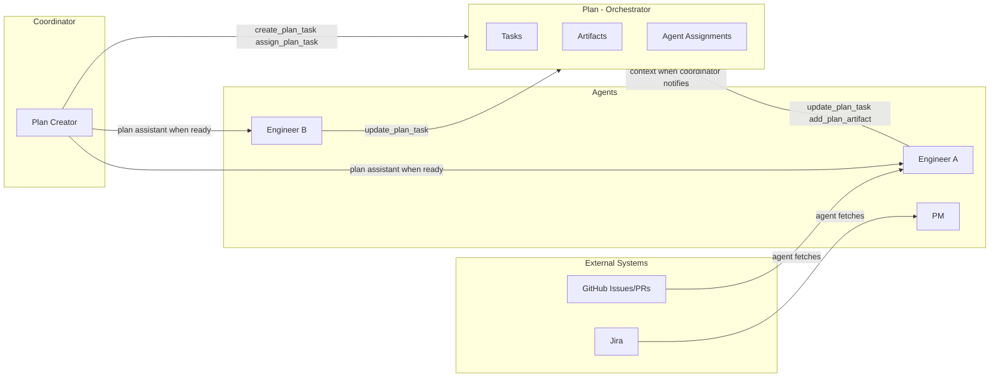

# Plans — Orchestrator

Plan is the **orchestrator** for agent work. It is a local Kanban board where a coordinator creates tasks, assigns agents, and decides when each agent engages. Plan does not sync with external systems; agents handle that.

## Plan as Orchestrator

Plan is driven by the **coordinator** (the agent who creates and manages the plan):

- **Tasks** — Kanban columns (Todo, In Progress, Blocked, Done) with agent assignments
- **Artifacts** — Shared outputs (summaries, handoff notes, deliverables) stored on the plan
- **Coordinator-driven engagement** — The coordinator decides when each agent starts working. Activation marks the plan ready; the coordinator uses the plan assistant to notify agents when needed. Not all agents need to be running or working at once.

Agents create and update tasks via plan tools (`create_plan_task`, `assign_plan_task`, `update_plan_task`, etc.). Plan stores what the coordinator and agents put in.

## Agents Handle External Data

Plan does **not** sync with GitHub, Jira, or other external systems. Agents do:

1. Use `gh`, Jira API, or other tools to fetch data from external systems
2. Create tasks via `create_plan_task` with context in the description
3. Include the external reference (e.g. "GitHub #42", "Jira PROJ-123") in the task description so other agents know the source

External systems remain the source of truth for their data. Plan is the coordination view.

## No Built-in Sync

Plan stores what agents write. There is no automatic sync, webhook, or background job that pulls from GitHub or Jira. Agents decide when and what to create.

## Multi-Source Coordination

One plan can coordinate work from multiple external sources. For example:

- Engineer A fetches GitHub issues and creates tasks
- PM fetches Jira tickets and creates tasks
- All tasks live on the same plan board; agents coordinate via task comments and artifacts

## Artifacts

Agents add shared outputs via `add_plan_artifact`:

- **Task deliverable** — Report or output for a specific task (use `task_id`)
- **Shared report** — Plan-level summary or handoff note (omit `task_id`)

Use clear filenames (e.g. `report.md`) so artifacts render correctly in the browser.

## Activation and coordinator-driven engagement

**Activate** marks the plan as ready. It does **not** require all agents to be running. The coordinator decides when to engage each agent:

- Use the **plan assistant** to send a message to a specific agent when you want them to start (e.g. "Your tasks are ready; please begin working on them.")
- Agents that are running at activation time receive context; others receive it when the coordinator notifies them via the plan assistant.
- Work can proceed in phases: coordinator engages Agent A first, then Agent B when A's output is ready, and so on.

## Flow



## Plan templates

Starting a plan from zero on every recurring workflow is tedious. **Plan templates** are reusable blueprints — a set of columns and pre-filled tasks — that you can apply when creating a plan. They live in the **Marketplace → Plan Templates** tab alongside Claw Templates, Skills, MCP Servers, and Software.

### Bundled starters

Clawforce ships with four starter templates in `marketplace/plan-templates/catalog.yaml`:

- **Product Launch** — default Kanban columns, five launch tasks (scope, brief, demo, content, enablement).
- **Sprint Planning** — default columns, six tasks covering grooming, goal-setting, estimation, standups, demo, retro.
- **Bug Triage** — custom columns (Triage, Investigating, Fix in Progress, Verified) seeded with intake tasks.
- **Research Project** — custom columns (Research, Synthesise, Draft, Publish) with tasks staged across each phase.

### Custom templates

Admins can add, edit, and delete **custom** plan templates from the Marketplace UI. Custom entries are stored in `{storage_root}/admin/custom_plan_templates.yaml`, merged with bundled starters at read time. An id present in the bundled catalog cannot be shadowed by a custom entry — pick a unique id.

Each template has:

| Field         | Purpose                                                                          |
|---------------|----------------------------------------------------------------------------------|
| `id`          | Unique slug identifier.                                                          |
| `name`        | Display name.                                                                    |
| `description` | Short summary (shown in card + detail modal).                                    |
| `author`      | Optional attribution.                                                            |
| `categories`  | Free-form tags.                                                                  |
| `columns`     | Optional — if omitted, the four default columns are used.                        |
| `tasks`       | List of `{ title, description, column }`. `column` is a short name or title.      |

Example:

```yaml
- id: bug-bash
  name: Bug Bash
  description: Rapid team-wide bug discovery and triage.
  author: Clawforce
  categories: [engineering]
  columns:
    - { title: Reported }
    - { title: Triaged }
    - { title: Fixing }
    - { title: Verified }
  tasks:
    - { title: Kick off bug bash, column: reported }
    - { title: Prioritise repro repros, column: triaged }
```

### Creating a plan from a template

On the `/plans` page, **Add Plan** now offers two modes:

- **Blank Plan** — the previous behaviour: name + description, default four columns, zero tasks.
- **From Template** — pick a template from the dropdown; the modal shows a preview of columns and task counts and pre-fills the plan name (still editable).

Under the hood, `POST /api/plans` accepts an optional `template_id`. When set, the server replaces the default columns with the template's columns (if defined) and creates each template task unassigned in the referenced column. If a task's `column` reference doesn't match any column, it falls back to the first column.

### REST API

| Method | Path                                     | Purpose                                               |
|--------|------------------------------------------|-------------------------------------------------------|
| GET    | `/api/plan-templates`                    | List bundled + custom templates                        |
| GET    | `/api/plan-templates/custom`             | List only user-managed custom templates                |
| GET    | `/api/plan-templates/{id}`               | Get a single template                                  |
| POST   | `/api/plan-templates`                    | Add a custom template (409 if id already exists)       |
| PUT    | `/api/plan-templates/{id}`               | Update a custom template                               |
| DELETE | `/api/plan-templates/{id}`               | Delete a custom template                               |
| POST   | `/api/plans` with `{"template_id": ...}` | Create a new plan seeded by the template's columns/tasks |

Plans are independent records once created — deleting the template they were created from does not affect existing plans.

## See also

- [Terminology](/reference/terminology) — Plan definition and "Plan vs external systems"
- [Role TOOLS.md](https://github.com/saolalab/clawforce/tree/main/marketplace/roles) — Agent guidance for planning and coordination
- [Plan templates catalog](https://github.com/saolalab/clawforce/tree/main/marketplace/plan-templates) — Bundled starter templates
